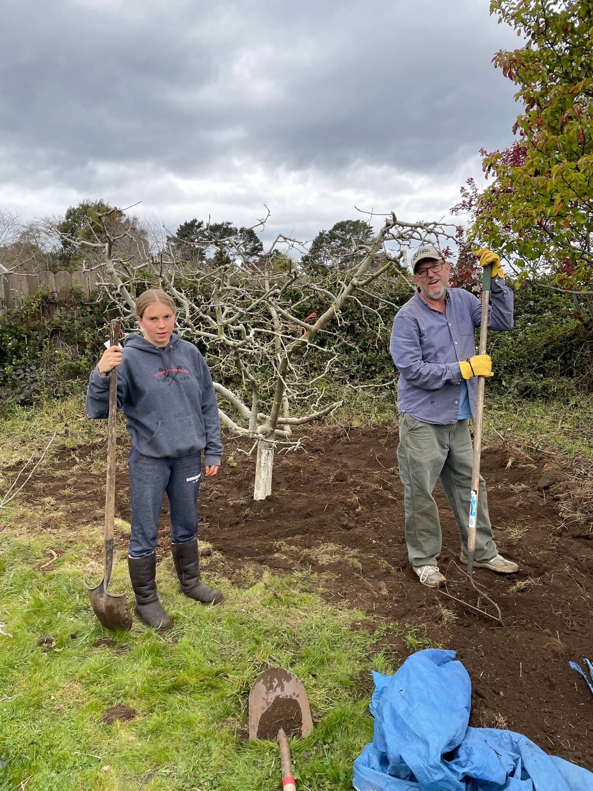
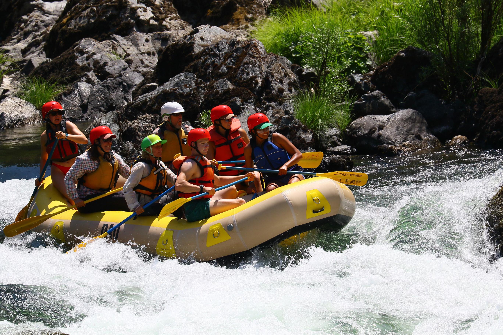
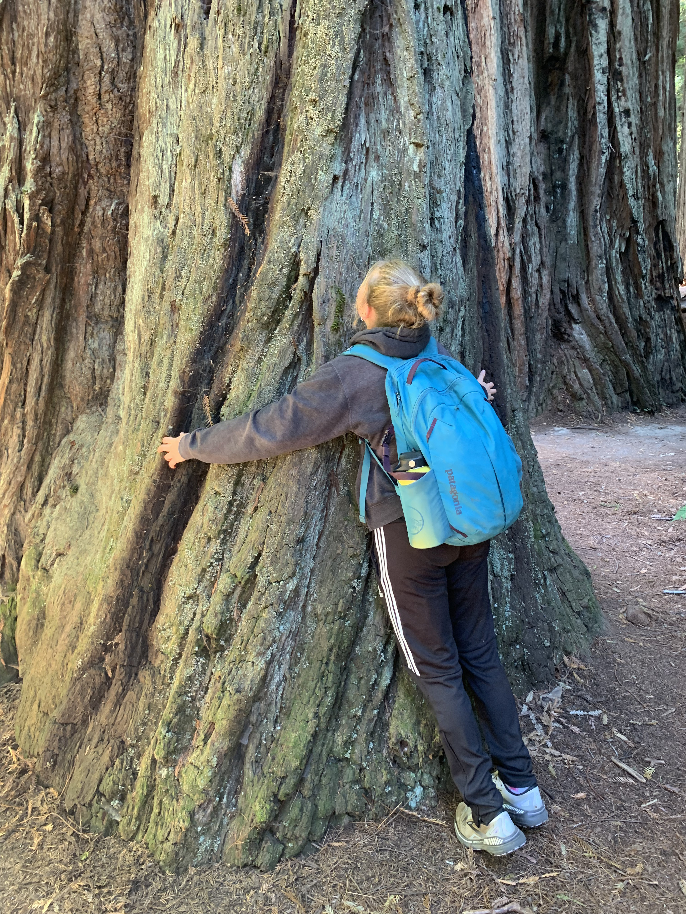
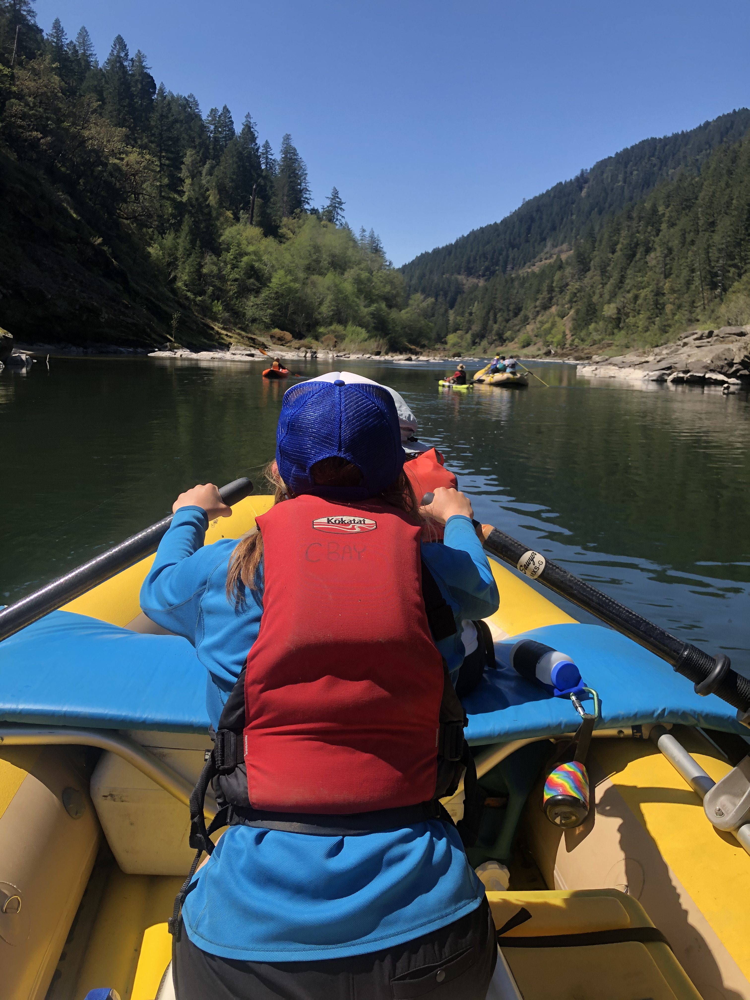
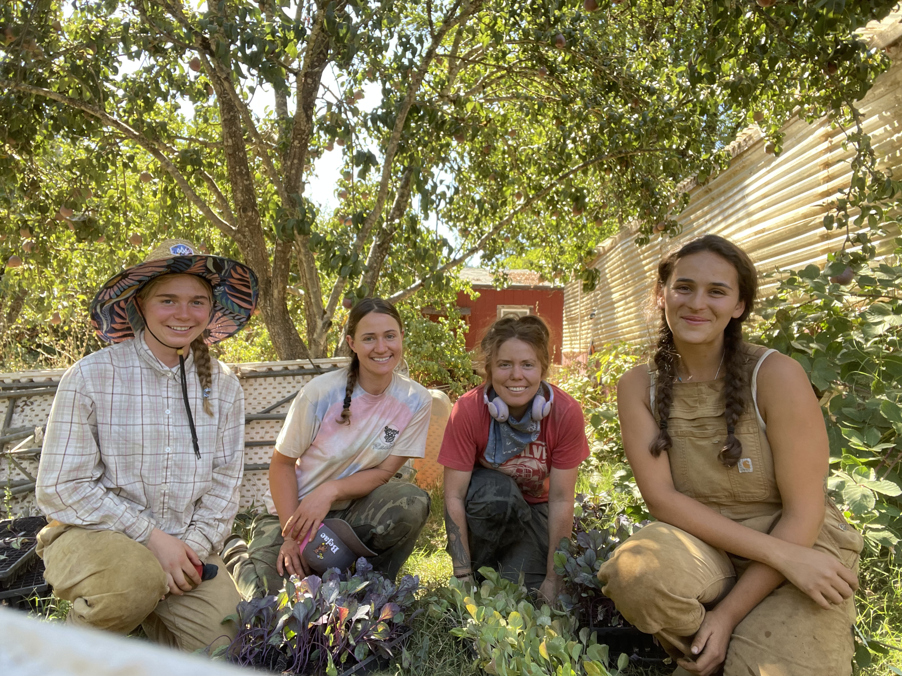

## Background

I’m from Humboldt county California and I don’t think I’ll ever recover from growing up in such a beautiful place with the tallest trees, a rugged coastline, the six rivers, and all the love and support in the world. I grew up learning Spanish in school, filling my free time with whatever sport was in season, and spending weekends with my parents exploring the northern part of the state. 

::: {layout-ncol=2}

::: {.lightbox group="ranch-gallery"}

:::

:::{.lightbox group="ranch-gallery"}
{group="ranch-gallery"}
:::

::: {.lightbox group="ranch-gallery"}
{group="ranch-gallery"}
:::

::: {.lightbox group="ranch-gallery"}
{group="ranch-gallery"}
:::

::: 

## Journey

After my first year of college, I was completely lost. I had effectively plucked myself out of the beautiful bubble I used to call home and moved myself somewhere where everything was different - the weather, the food, the people, and even the Pacific ocean had a whole new feel in Santa Barbara. The year away from home had changed my ideas about what I wanted to pursue personally, academically, and career wise. But after returning home to my familiar corner of the state, I discovered something new that helped start on another track - I love agriculture! On a small organic farm, under the hot summer sun, I found what I have come to think of as my “ikigai” - the intersection of what I love, what I am good at, what the world needs, and what I can be paid for (at least a little).

## Agriculture

I currently work on a large organic avocado ranch in Goleta California. My role is working on about an acre to grow fruits and vegetables for the community. We have about half an acre dedicated to traditional row crops and another half an acre that we've turned into a food forest. 

Shortly after I found my passion for agriculture I discovered agroforestry and since then I have been learning all about its benefits, how it works, and how we can convert more of the US agricultural system to improve the sustainability of their practices. 

This fascination led to me getting my job on the ranch where I have taken charge of the food forest. It is very young still but it includes many species of fruit trees as well as mediteranean nitrogen fixing trees to fill in gaps. 

Each spring we sew a soil building cover crop that we chop and drop onto the ground with the intention of aerating the soil and adding organic matter. 

