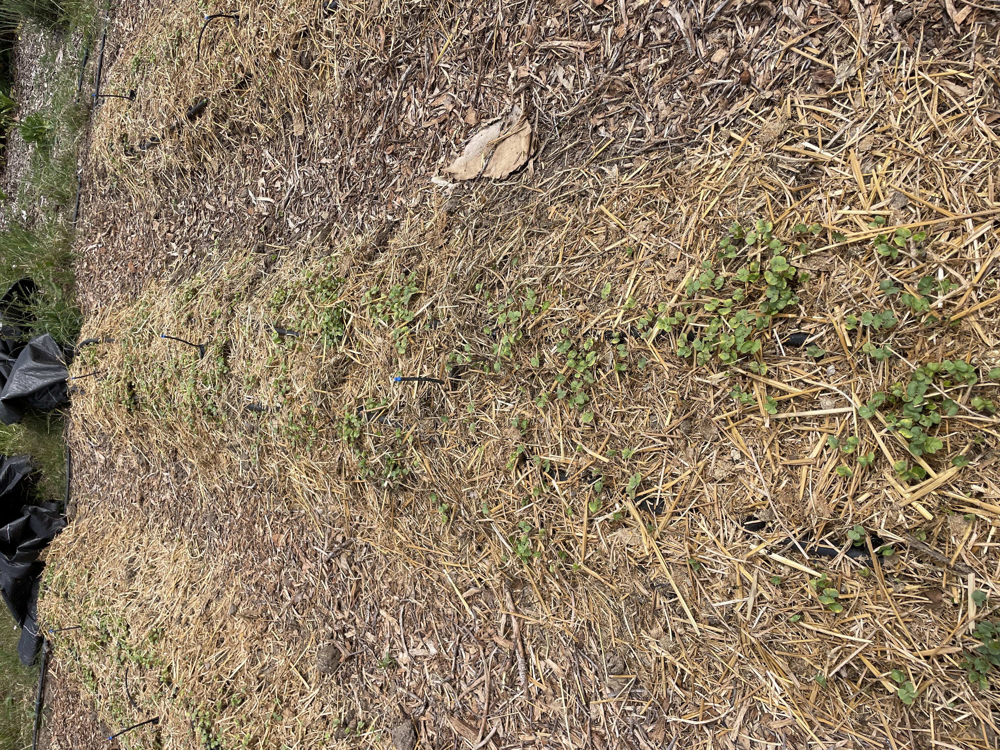
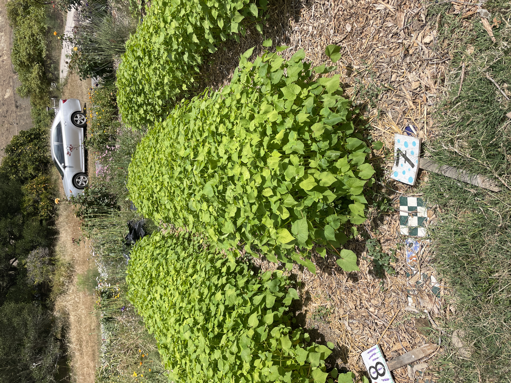
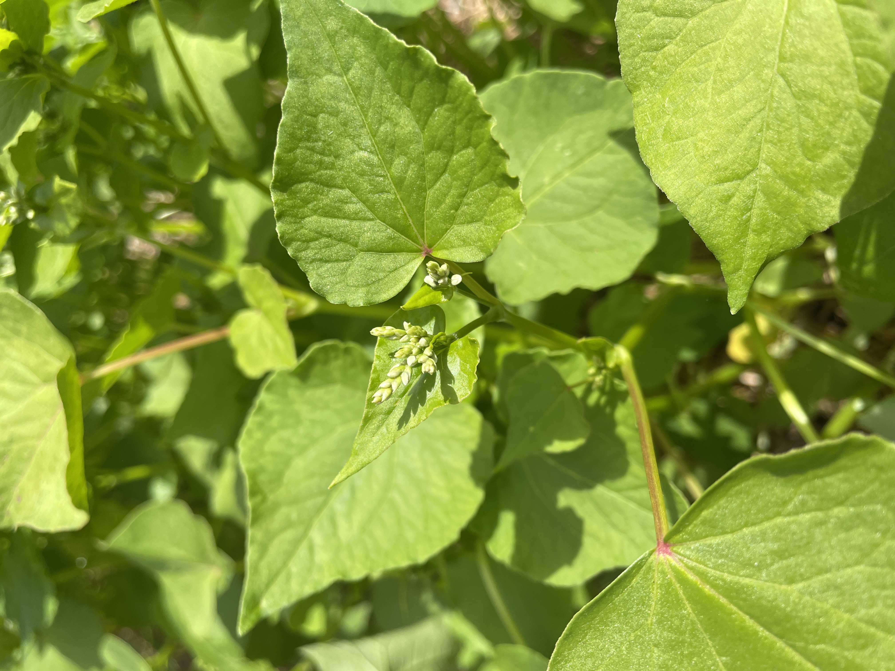

At the ranch we experimented with sowing buckwheat as a warm weather cover crop in a few of our rows. These rows had previously been completely covered in bermuda grass, a nasty rhizomous grass that quickly takes over space that we'd rather use for planting vegetables. It took our team of about 6 interns the better part of the winter to clear out the weeds and remediate the soil. On April 28th we densley sowed the buckwheat seed in each of the rows. By May 4th, this is what it looked like:

The buckwheat grew really nicely and so far seems to be a great success. It is kind of hard to tell because we intentionally planted the seeds so densely but the hope is that the buckwheat has been able to out compete the bermuda grass. The main reason I wanted to try buckwheat as a cover crop is that it germinates quickly which allows it to suppress competing weeds by shading out weeds and taking up space.

Other benefits include adding organic matter to soil quickly, improving soil structure, scavenging phosphorous and attracting pollinators. 

Seven to ten days after flowering we will chop the buckwheat down to prevent it from going to seed. If it goes to seed, the wind will spread it's seed over the farm and it could become a "weed". After the buckwheat is cut down, we will leave the plant matter on top of the soil and let it decompose and incorporate into the soil. 

