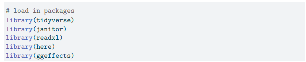
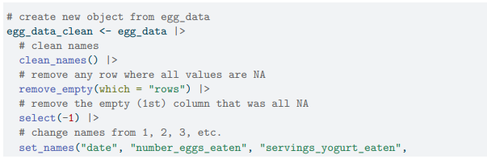
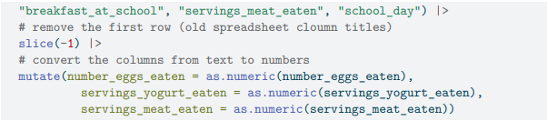
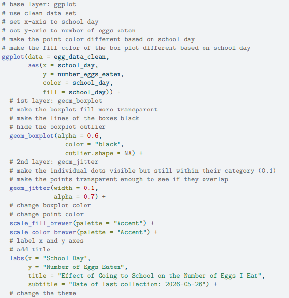
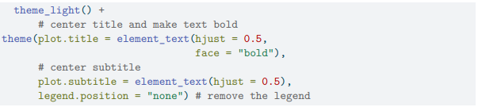

Here is a sample of some code I wrote for a personal data project that I did. I collected data on the number of eggs I ate in a day along with data from other variables such as whether or not I had school and how many servings of meat I ate.

First, my packages:

Then, I organized my data:

And made a visualization:

Here is what the plot lookede like 

