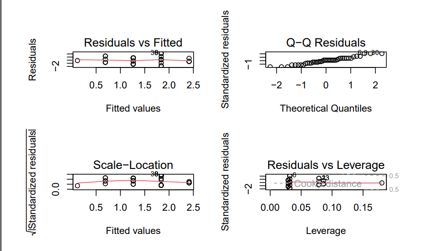
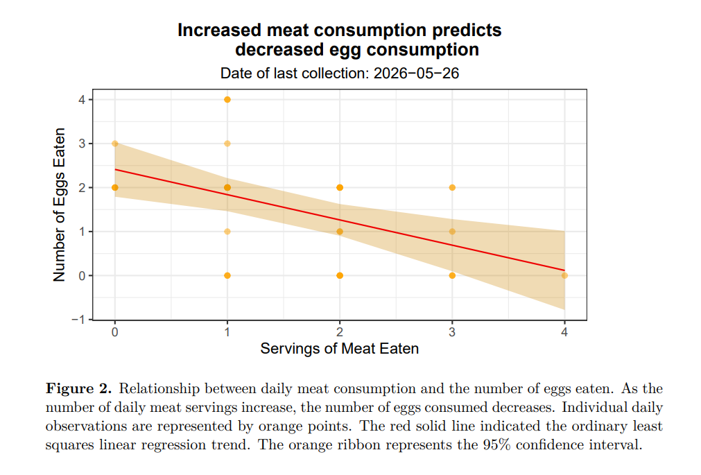

Here is a sample of some code I wrote for a personal data project that I did. I collected data on the number of eggs I ate in a day along with data from other variables such as whether or not I had school and how many servings of meat I ate.

My inspiration comes mainly from my excitement about raising chickens. I'm not sure if I should try raising chickens for eggs, meat, or both. This data collection was one way that I tracked my consumption of of chicken products. 

First, my packages:

Here is a sample of some code I wrote for a personal data project. First, my packages:

```r
# Code chunk to load in my packages
library(tidyverse)
library(leaflet)
``` 

Then, I organized my data:

```r
# create new object from egg_data
egg_data_clean <- egg_data |>
# clean names
clean_names() |>
# remove any row where all values are NA
remove_empty(which = "rows") |>
# remove the empty (1st) column that was all NA
select(-1) |>
# change names from 1, 2, 3, etc.
set_names("date", "number_eggs_eaten", "servings_yogurt_eaten",
"breakfast_at_school", "servings_meat_eaten", "school_day") |>
# remove the first row (old spreadsheet cloumn titles)
slice(-1) |>
# convert the columns from text to numbers
mutate(number_eggs_eaten = as.numeric(number_eggs_eaten),
servings_yogurt_eaten = as.numeric(servings_yogurt_eaten),
servings_meat_eaten = as.numeric(servings_meat_eaten))
```
I created a linear model:

```r
# create new object to store linear model
# formula: lm(dependent ~ independent, data = data frame)
egg_model <- lm(number_eggs_eaten ~ servings_meat_eaten,
data = egg_data_clean)
# show summary of linear model
summary(egg_model)
```
This was the output

```r
Call:
lm(formula = number_eggs_eaten ~ servings_meat_eaten, data = egg_data_clean)
Residuals:
Min 1Q Median 3Q Max
-1.8382 -0.6900 0.1618 0.7359 2.1618
Coefficients:
Estimate Std. Error t value Pr(>|t|)
(Intercept) 2.4123 0.3072 7.851 1.26e-09 ***
servings_meat_eaten -0.5741 0.1689 -3.399 0.00154 **
---
Signif. codes: 0 '***' 0.001 '**' 0.01 '*' 0.05 '.' 0.1 ' ' 1
Residual standard error: 1.047 on 40 degrees of freedom
Multiple R-squared: 0.2241, Adjusted R-squared: 0.2047
F-statistic: 11.55 on 1 and 40 DF, p-value: 0.001543
```

I checked my assumptions:

```r
# create 2x2 grid to show diagnostic plot
par(mfrow = c(2,2))
# show diagnostic plots
plot(egg_model)
```

<div class="column-body-inset" style="max-width: 350px; text-align: left;">

</div>

And made a visualization:

```r
# create new object to store predictions of the model
egg_predict <- ggpredict(egg_model, terms = "servings_meat_eaten")
# base layer: ggplot
ggplot(data = egg_predict, # use predictions data frame
aes(x = x, # x-axis: x
y = predicted # y-axis: predicted
)) +
# 1st layer: geom_point to show raw data points
geom_point(data = egg_data_clean,
aes(x = servings_meat_eaten,
y = number_eggs_eaten), #
color = "orange", # point color = dark green
alpha = 0.5) + # make points slightly transparent
# 2nd layer: ribbon to show 95% CI
geom_ribbon(aes(ymin = conf.low, # lower bound of 95% CI
ymax = conf.high), # upper bound of 95% CI
fill = "orange3",
alpha = 0.3) + # make ribbon transparent
# 3rd layer: line representing model predictions
geom_line(color = "red2") +
# relabel x and y axes and add title
labs(x = "Servings of Meat Eaten",
y = "Number of Eggs Eaten",
title = "Increased meat consumption predicts
decreased egg consumption",
subtitle = "Date of last collection: 2026-05-26") +
# change theme
theme_bw() +
# center title and make text bold
theme(plot.title = element_text(hjust = 0.5,
face = "bold"),
# center subtitle
plot.subtitle = element_text(hjust = 0.5))
```

Here is what the plot looked like!

<div class="column-body-inset" style="max-width: 350px; text-align: left;">

</div>


